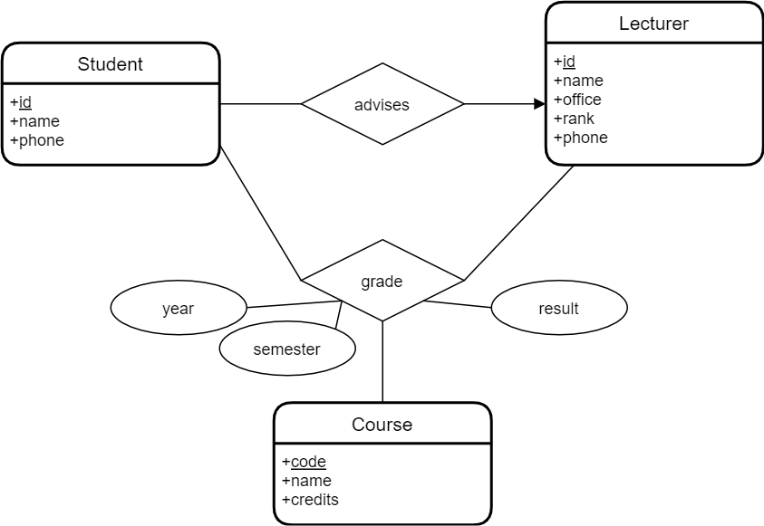
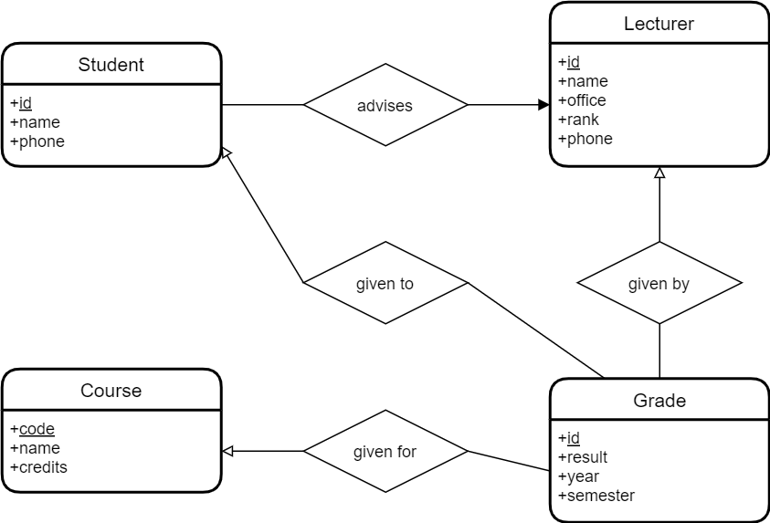
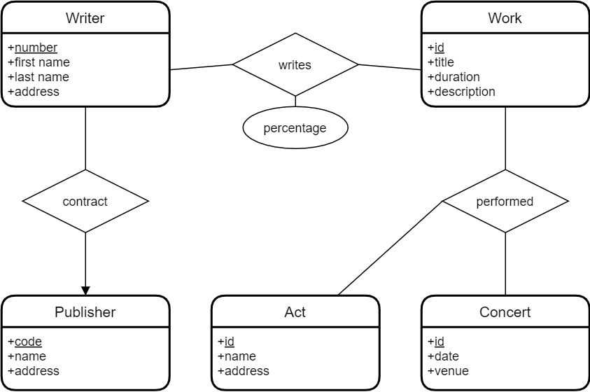
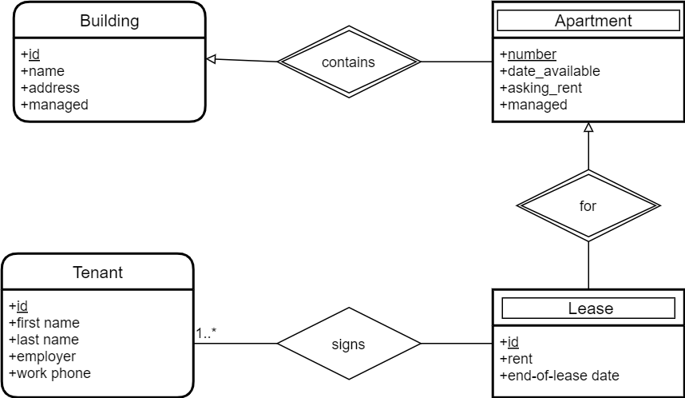

# Entity-Relationship Modeling

- *Relational data model* (or *relational model*)
- *Entity-Relationship Model* (or *ER Model*)
- Examples

## Relational Model

- **Relation (table)**: 2-dim table, set (not list) of tuples
- **Attributes**: table columns, fields
- **Schema**: Movies(title, year, length, filmType)
- **Tuples**: rows in the table, records
- **Domains**: types

### Example Table from a World Database

#### Table: **country** (sample data, sorted by country name)

### Terminology (1)

- **Entity**: Something of interest to the database user community.
    - customers, parts, geographic locations
- **Column**: An individual piece of data stored in a table.
- **Row**: A set of columns that together completely describe an entity or some action on an entity. Also called a
  record.
- **Table**: A set of rows, held either in memory (nonpersistent) or on permanent storage (persistent).

### Terminology (2)

- **Result Set**: Another name for a nonpersistent table, generally the result of an SQL query.
- **Primary Key**: One or more columns that can be used as a unique identifier for each row in a table.
- **Foreign Key**: One or more columns that can be used together to identify a single row in another table.

## Steps to create a new database

1. **Conceptual Model**: model (or design) the database at the *logical* level
    - we are using the traditional **ER model**
    - but we could use other approaches, for example the *UML model*

2. **Relational Data Model**: convert the conceptual model into the relational data model
    - we could use other data models, such as the *object-relational* model or other non-relational models (OO, NoSQL
      models, ...)
    - the relational model is the most common model, and it cannot be skipped or ignored when learning about data bases

3. **Database Instance Creation**: generate the necessary `CREATE TABLE` and other SQL statements to create a database
   instance, and fill it with data

- After the database has been created, you can start using it (`SELECT` statements, data updates, ...)

### Entity-Relationship (ER) Model

- **Entity sets**: rectangles
- **Relationship sets**: diamonds
- **Attributes**: ovals
- **Arrow heads** for connecting relationship sets to entity sets:
    - *solid black triangle*: at most 1
    - *open round* or *transparent triangle*: exactly 1
    - no arrow heads: many
- **Primary keys**: underlined attribute names

#### Contacts DB

- *entities*: `Contact`, `Call`
- *relationship*: `from`
    - *many-one* relationship from `Call` to `Contact`
- *attributes*: all ovals
- *primary keys*: `Contact.contact_id`, `Call.call_id`

#### Contacts DB Alternative Notation

### Simple Bank Database

- The database application called BANK, which keeps track of a Bank’s customers and their accounts.
    - Customers are identified by their name, address, phone and customer ID.
    - Accounts have numbers, types (e.g., savings, checking) and balances.
    - Also record the customer(s) who own an account.
    - A transaction takes place on exactly one account.
    - Each transaction has an ID, a code, an amount, a date, a time and a description.

### College Database

- In this database, you have to record students, lecturers, courses, grades and student advisers.
    - Every student has a student number, a name and an address.
    - Every lecturer has an employee number, a name, an office room number, a rank and a phone number.
    - For each course, its code, name and number of credits are recorded.
    - A grade is given to a student by an lecturer for a course taught during a semester (A, B, or C) of a particular
      year.
    - Student's advisers are lecturers.

### Music Copyrights Database

- You are asked to design a music copyright collection agency database, including information as follows:
    - A writer has a writer number, first name, last name and address.
    - Writers may be signed with a publisher. Publishers sign up many writers.
    - Publishers have a publisher code, name and address.
    - Writers write works. Works may have more than one writer. Each writer writes a percentage of a work.
    - A work has a title, duration and description.
    - Works get performed at concerts (or music shows) by an act.
    - A concert has a date and a venue.

### Apartments for Rent

- You have to design a database to manage the information of a company managing a set of apartments for rent.
    - This company manages many buildings, each consisting of at least one apartment.
    - Suppose that an apartment can be uniquely identified by its number within its building.
    - For each apartment, there is at least one tenant, if it is rented.
    - The monthly rent and the end-of-lease date (if known) must be included.
    - For each apartment available soon, the date of availability and the asking monthly rent must be included.
    - For each tenant, the first name, last name, the home phone number, the name of his/her employer and his/her work
      phone number must be included.

- This end-of-lease date is not always the day after the end of the previous lease because an apartment could be
  unavailable for some time because of renovations, for example.
- Following a similar reasoning, the asking monthly rent is not necessarily the same as the current rent.

### Weak Entitiy: Apartment

#### Traditional Notation

### Weak Entitiy: Apartment

#### Alternative Notation

### Apartments for Rent

#### Full diagram

### Apartments for Rent

#### Improved diagram

